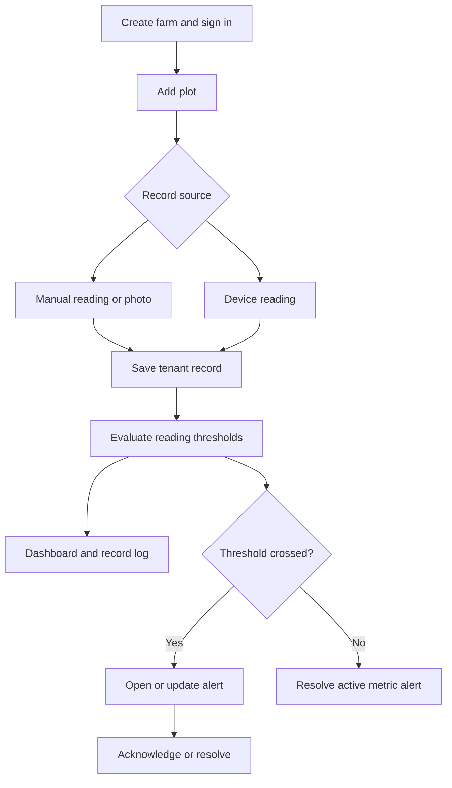
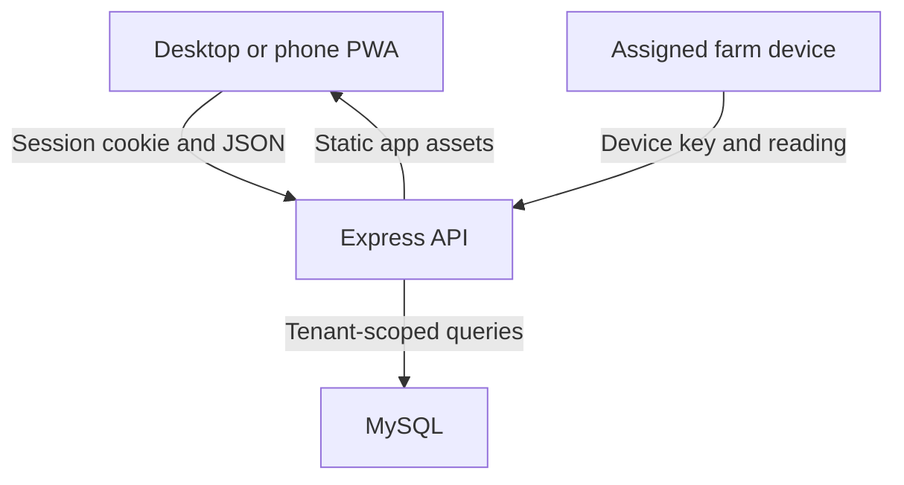
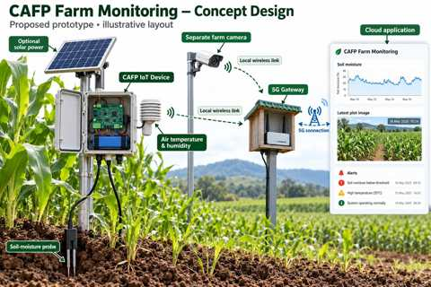
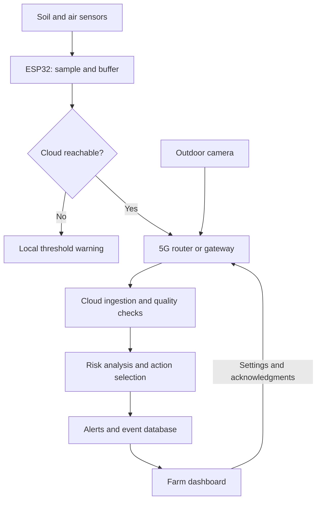
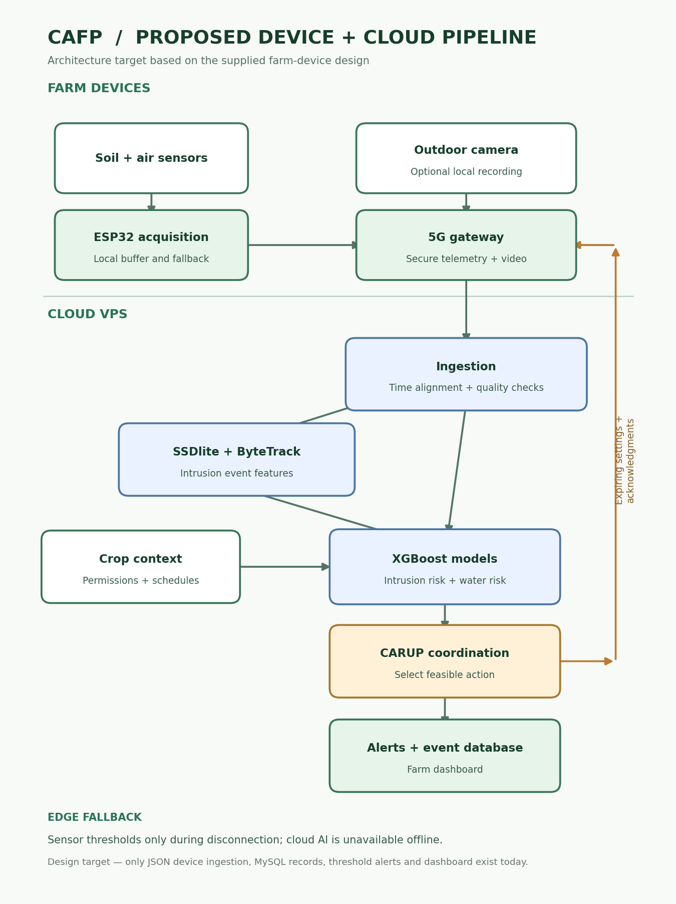

# CAFP Farm Monitoring

Multi-tenant mobile and desktop farm monitoring app with a MySQL backend. Farms have isolated plots, devices, records, alert settings, users and audit events.

For step-by-step use, see the [User Guide](docs/USER_GUIDE.md). For architecture, local development, database changes, API conventions, testing, and releases, see the [Developer Guide](docs/DEVELOPER_GUIDE.md).

## Flow chart

The main workflow starts with a farm account and plot. A person or assigned device then saves a reading. Threshold evaluation updates the dashboard and may open or resolve an alert.



Photos are saved without threshold evaluation. An alert can be reopened from the Alert center; a later violating reading can open a new alert after resolution.

## System design



The Express server serves the responsive interface and API. MySQL holds farms, users, plots, devices, records, settings, alerts, and audit events. The PWA caches app assets; it needs a network connection for API data.

### Visual concept



The image is a design illustration. The current repository does not include the pictured physical sensor, solar equipment, or 5G gateway firmware.

### Farm device data flow (proposed)

This is the operating sequence described in the supplied blueprint. It is a **design target**. The server accepts authenticated JSON readings and now stores camera snapshots and short MP4 clips. ESP32 firmware, video AI, and edge warning firmware are not included.



1. **Sense:** Soil and air sensors measure field conditions. The camera can capture visual evidence independently.
2. **Buffer and check locally:** The ESP32 samples sensor values, keeps a short local queue, and compares readings against local thresholds. During an outage, a local indicator could warn staff. Neither buffering nor local warnings are implemented yet.
3. **Connect:** A gateway or router carries sensor readings and optional camera data over the farm's network. `/api/ingest` accepts JSON readings with a device key; `/api/media/device` accepts JPEG, PNG, and MP4 captures using a camera or gateway key.
4. **Validate and analyze:** The server validates measurement ranges, associates a provisioned device with its assigned plot, stores readings and separate media assets, and evaluates moisture and temperature thresholds. Time alignment, computer vision, XGBoost, and CARUP coordination are proposed additions.
5. **Alert and review:** The current alert database and dashboard show threshold events. Authorized users can acknowledge, resolve, or reopen them. Cloud-to-gateway settings and acknowledgments are not implemented.



The design image is generated with `python3 tools/render_architecture.py` using Matplotlib and Pillow. It shows the planned ESP32, camera, 5G gateway, cloud analysis, and feedback loop.

| Layer | Running now | Planned in the blueprint |
| --- | --- | --- |
| Farm devices | Provisioned device inventory, JSON ingest key, and optional RTSP feeder for existing streams. | ESP32 sampling and buffering, camera, gateway, local warning. |
| Cloud input | Range validation, device-to-plot assignment, bounded photo/MP4 intake. | Video intake, time alignment, and quality checks. |
| Analysis | Tenant-specific moisture and temperature thresholds. | SSDlite/ByteTrack intrusion events, XGBoost risk models, crop context, and CARUP action selection. |
| Results | MySQL records, camera gallery, alerts, acknowledgments, and dashboard. | Expiring settings and acknowledgments sent to the gateway. |

## Features

| Area | Functions |
| --- | --- |
| Accounts | Register a farm and owner; invite a member with a one-time, seven-day registration link; sign in with farm name and email; edit your profile and password; sign out. |
| Overview | Latest moisture and temperature, plot/device counts, soil moisture trend, recent activity, latest photo, persistent threshold alerts, manual refresh. |
| Alert center | Tenant-scoped warning/critical alerts from new readings; acknowledge, resolve with a note, reopen, bulk actions, status/severity/plot/search filters, CSV export, and periodic refresh. |
| Field records | Save readings or compressed plot photos with time and notes; filter, view, delete, and export records. |
| Plots | Add, edit, and delete plots with crop and area details. |
| Devices | Add sensor/camera/gateway devices, assign plots, edit status, rotate or revoke one-time ingest keys, view last-seen time. |
| Camera media | Upload Wyze-exported photos/MP4 clips, browse and download tenant-scoped media, delete media as owner/admin, or feed captures from an existing RTSP stream. |
| Farm events | Create sensor or camera rules, request manual actions, approve or cancel queued actions, and track gateway results for irrigation, drone-house opening, and drone launch. |
| Settings | Set alert thresholds, import readings CSV, export JSON snapshot, review audit events. |
| Navigation and mobile | Grouped Workspace, Manage, and Account navigation; Getting started shortcuts and Get the app installation page; responsive browser interface and installable PWA; camera capture on supported devices. |

This is one web/PWA codebase, not separate native Android and iOS apps. Alerts are in-app; email, SMS, and push notifications are not implemented.
Invitation links are displayed for an owner/admin to share privately; the app does not send invitation emails or verify mailbox ownership.

## Roles

| Action | Owner | Admin | Operator | Viewer |
| --- | :---: | :---: | :---: | :---: |
| View dashboard, plots, devices, records | Yes | Yes | Yes | Yes |
| Add records, edit plots, delete records | Yes | Yes | Yes | No |
| Acknowledge, resolve, or reopen alerts | Yes | Yes | Yes | No |
| Delete plots, manage devices and thresholds | Yes | Yes | No | No |
| Manage team and view audit | Yes | Yes* | No | No |
| Add or edit admins | Yes | No | No | No |

\* Admins cannot edit an owner or another admin. The Settings & data screen is visible to owners and admins; the API also allows operators to import readings.

## Run with MySQL and Docker

1. Copy `.env.example` to `.env` and set strong `MYSQL_PASSWORD` and `MYSQL_ROOT_PASSWORD`. Set `COOKIE_SECURE=true` behind HTTPS. The Compose file binds only to localhost by default.
2. Run `docker compose up -d --build` from this repository. The schema initializes on the first creation of the MySQL volume.
3. Reverse proxy HTTPS to `127.0.0.1:8080`, then open that address and register a farm owner account. Do not expose the HTTP port to the internet without HTTPS.

For local development, run `mysql < db/schema.sql` with an authorized MySQL account, set the environment variables, then run `npm install && npm start`.

## User manual

The [full User Guide](docs/USER_GUIDE.md) includes roles, camera setup, farm event status, and troubleshooting.

### Create a farm and sign in

1. Open the app and choose **New farm? Create an account**. Enter farm name, your name, email, and a password of at least 12 characters. This creates the owner account.
2. For later sign-ins, enter the exact farm name, email, and password. The same email can belong to different farms, so the farm name is required.
3. Owners/admins invite members through **Team**. Members set their own passwords through the one-time invitation link. Use **Sign out** on shared devices.

For member self-registration, an owner/admin opens **Team**, enters the member's email and role, and selects **Create invitation**. Copy the private link immediately and share it with that person. The invitee opens the link, checks the invitation, enters a name and password (12+ characters), and selects **Create my account**. The link expires after seven days, can be used once, and can be revoked while pending. The farm name, email, and role are fixed by the invitation. The app signs the member in after registration. Existing members use the normal farm sign-in form.

Use **My profile** to update your name or password. Changing the password requires the current password and signs out other sessions. **Getting started** links to the actions available for your role. On a phone, swipe the bottom navigation horizontally to reach more pages.

### Add plots and observations

1. In **Plots**, enter a name and optional crop and area, then select **Add plot**. **Edit** changes details. Owners/admins can **Delete** a plot only after its records are deleted.
2. Select **+ Add record** or **Capture record**. Choose a plot, record type, and observation time.
3. For **Sensor / field reading**, enter at least one measurement: moisture 0–100%, temperature -50 to 70°C, or humidity 0–100%. Notes are optional. Select **Save record**.
4. For **Plot photo**, choose or capture an image and select **Save record**. The browser compresses the image; the API accepts an image payload of roughly 2 MB.
5. **Farm overview** shows the latest readings, moisture trend, recent activity, photo, and alerts. The default alert thresholds are 20% low moisture and 35°C high temperature.

### Work with alerts

Every new manual, imported, or device reading is checked against the farm's moisture and temperature thresholds. The first violating reading opens an alert for its plot and metric. Further violating readings update its value, severity, and occurrence count. A normal reading for that metric automatically resolves the active alert. Critical severity means moisture is below half the low threshold or temperature is more than 10°C over the high threshold.

Open **Alerts** or use **Manage alerts** on the dashboard. Filter by status, severity, or plot; search the fetched list; then use **Refresh** or **Export shown CSV**. Operators, admins, and owners can **Acknowledge**, **Resolve** (with an optional note), or **Reopen** an alert. Select active alerts and choose **Acknowledge selected** or **Resolve selected** for bulk action. Acknowledgment keeps the alert active. A newly violating reading can create another alert after one has been resolved. The **Edit thresholds** button takes an owner or admin to Settings & data.

The alert screen refreshes every 60 seconds while visible. It fetches up to 500 alerts for a filter; search and CSV export use that fetched set. Threshold changes affect new readings and do not retroactively recalculate historical records. Existing database volumes receive the alerts table when the server starts. No external notification channel or background device-offline detector is included.

### Review and export records

Open **Field records** and filter by all records, readings, or photos. **View photo** opens an image. Users with edit rights can **Delete** a record; the interface has no undo. **Export CSV** downloads the dashboard's loaded records, up to 500, regardless of the visible filter. The `/api/records` endpoint can return up to 1,000 recent tenant records.

### Connect devices

An owner/admin opens **Devices**, enters a label, selects sensor/camera/gateway and a plot, and clicks **Add device**. Copy the displayed key immediately: the secret appears only on creation or rotation. A device without an assigned plot cannot ingest readings. **Edit** changes its label/status; **Rotate key** invalidates the old key; **Delete** revokes the device key.

Send `POST /api/ingest` with the header `x-device-key: <device-id>.<secret>` and JSON:

```json
{"time":"2026-10-05T08:00:00Z","moisture":28.5,"temperature":31,"humidity":62}
```

At least one measurement is required. The assigned plot determines where the reading is stored. Successful ingestion updates the device's last-seen time and online status. Store keys securely; the server stores their hashes.

### Wyze Cam v3 pictures and video

1. Create a plot, then create a **camera** (or **gateway**) device assigned to that plot in **Devices**. Save the one-time device key securely.
2. With stock firmware, use the Wyze app to download a photo or event video to your phone. Open **Camera media**, choose that plot and a JPEG, PNG, or MP4 file, and select **Upload media**. Any owner, admin, or operator can upload; owners/admins can delete. The gallery has playback, download, and refresh controls. Each file is limited to 8 MB. These uploads are separate from threshold reading records.
3. If your Cam v3 *already* exposes a local RTSP URL, install `ffmpeg` and Python 3 on a gateway on the same camera network. Set `WYZE_RTSP_URL`, `CAFP_URL` (HTTPS), and `CAFP_DEVICE_KEY` as protected environment variables, then run `python3 gateway/wyze_rtsp_feeder.py --once` to test a snapshot. For ongoing captures, run without `--once` (default: every five minutes). Add `--clip-seconds 10` to upload a short MP4 with each snapshot. Install Pillow and add `--motion-threshold 0.15` to compare successive snapshots and report camera motion to the automation engine. Motion difference is not intrusion detection. Use a service manager for continuous operation. Do not expose RTSP to the public internet.

Wyze says its Cam v3 RTSP firmware downloads have been removed while it reviews support, so a stock camera cannot be assumed to have an RTSP URL. CAFP does not flash firmware or call an undocumented Wyze cloud API. The feeder needs an already working stream; manual export/upload works without RTSP. This version stores media bytes in MySQL for simple installation. Plan storage capacity and backups accordingly. There is no live browser stream or object detection in this release.

### Farm events and equipment control

The **Farm events** screen connects field data to an auditable gateway command queue:

1. Assign a **gateway** device to each plot with equipment control. Keep its one-time key on the gateway only. Create a rule as an owner/admin: select plot, gateway, signal, action, and cooldown. Moisture triggers when **below** the rule threshold; temperature triggers when **above** it. Camera motion comes from the optional snapshot difference feeder; `camera_intrusion` can be sent by a separate authenticated analysis service. No intrusion AI is included here.
2. Select **Request action** to propose irrigation (1–300 seconds), opening the drone house, or launching the drone. Manual requests await owner/admin approval. A manual drone request requires a *different* owner/admin to approve it.
3. Automatic rules normally create a pending approval event. Only an owner/admin can opt to auto-queue **irrigation**; drone-house and drone actions always need approval. Repeated signals within the rule's cooldown do not create another command. Pause/enable or delete rules from the same screen.
4. The gateway worker polls `POST /api/automation/gateway/poll`, receives one queued command, runs a site-specific adapter, then acknowledges success/failure at `POST /api/automation/gateway/:id/ack`. The screen shows pending, queued, claimed, succeeded, failed, and cancelled states. A command is **not retried automatically** after claim, to avoid duplicate physical operation. Investigate any claimed command that has no acknowledgment.

`gateway/command_worker.py` is the queue client, not a ready-made relay or drone controller. Set `CAFP_URL` to the HTTPS server and `CAFP_DEVICE_KEY` to an assigned gateway key. Provide executable absolute paths in `IRRIGATION_ADAPTER`, `DRONE_HOUSE_ADAPTER`, and `DRONE_LAUNCH_ADAPTER`. Each adapter receives the unique command ID and duration seconds as arguments, must enforce local interlocks and idempotency, and exits zero only after confirming the physical action. Run `python3 gateway/command_worker.py --enable-actuators` only after testing the site's hardware and emergency stop. Drone launch additionally requires `DRONE_ARMED=true` on the gateway. Without a configured executable adapter, the worker reports failure. CAFP does not pilot, navigate, or land a drone.

An authenticated gateway may send `POST /api/automation/device-event` with its `x-device-key` and JSON `{"signal":"camera_motion","detail":"motion score 0.2"}` or `camera_intrusion`. The feeder can generate `camera_motion`; intrusion requires an external detector. The camera signal is scoped to the gateway's assigned tenant and plot. No raw camera credentials or actuator endpoints are exposed to browser users.

### Manage the team and thresholds

In **Team**, create and revoke invitations, review members, and use **Edit access** to change a member's name, role, active state, or password. Disabling a user or changing their password invalidates existing sessions. Admins cannot invite or edit another admin. In **Settings & data**, set low moisture and high temperature and select **Save thresholds**. This screen also shows the 100 most recent audit events.

### Import and back up data

In **Settings & data**, select **Import readings CSV**. Create the named plots first. The CSV requires `time` and `plot` columns; `moisture`, `temperature`, `humidity`, and `note` are optional. Plot may be a name or ID. Each row needs a parseable date/time and at least one measurement. Imports accept at most 500 rows per request and report imported/skipped counts.

```csv
time,plot,moisture,temperature,humidity,note
2026-10-05T08:00:00Z,North Field,28.5,31,62,Early reading
```

**Export JSON backup** downloads the current dashboard snapshot, including up to 500 recent records and up to 100 active alerts. It is not a complete database backup, and there is no JSON restore button. Back up the MySQL volume separately.

### App downloads and installation

Open the app's HTTPS address and select **Get the app** on the sign-in screen or under Account. **Install CAFP** opens the browser installation prompt when available; otherwise it shows platform steps. Android users can install from Chrome; iPhone/iPad users can use Safari’s Share → Add to Home Screen. **Copy app link** shares the current hosted app address. There is no APK, IPA, or app-store package in this repository. API actions and fresh data require a network connection. Camera capture depends on the phone and browser.

## API

Authenticated browser routes use an HttpOnly session cookie. `GET /api/dashboard` returns tenant scoped dashboard data. `GET/POST/PUT/DELETE /api/plots`, `/api/devices`, `/api/records`, `/api/users`, and `/api/settings` serve the GUI according to role. `GET /api/audit` lists recent events. `POST /api/records/import` accepts up to 500 reading objects per request. Records are limited to the newest 500 in the dashboard and 1,000 in the log.

`GET/POST /api/automation/rules` and `PUT/DELETE /api/automation/rules/:id` manage tenant rules; `GET/POST /api/automation/events` lists and requests events; `/approve` and `/cancel` change pending commands. Gateway-key routes are `POST /api/automation/device-event`, `/api/automation/gateway/poll`, and `/api/automation/gateway/:id/ack`.

`GET /api/media` lists the latest 100 farm media items; `POST /api/media?plot=<id>` uploads a signed-in user’s JPEG/PNG/MP4; `GET /api/media/:id` serves or downloads a tenant-scoped asset; owners/admins can `DELETE /api/media/:id`. A provisioned camera or gateway uploads binary media to `POST /api/media/device` with its `x-device-key` and `Content-Type`; its assigned plot fixes the tenant and plot. Uploads are capped at 8 MB.

`GET /api/auth/invitations/:token` checks a private invite; `POST /api/auth/register-member` consumes it atomically and creates a member session. `GET/POST /api/invitations` lists/creates tenant invitations; `DELETE /api/invitations/:id` revokes one. `PUT /api/profile` updates the signed-in member's name/password. The app creates the `invitations` table on startup for existing MySQL volumes.

`GET /api/alerts` supports `status` (active/open/acknowledged/resolved/all), `severity`, `plot`, and `limit` (up to 500). `POST /api/alerts/:id/acknowledge`, `/resolve`, and `/reopen` change one alert. `POST /api/alerts/bulk` accepts an `action` of `acknowledge` or `resolve` and up to 100 alert IDs. These actions require an owner, admin, or operator role and are scoped to the signed-in farm.

A device sends `POST /api/ingest` with `x-device-key: <device-id>.<secret>` and JSON `{ "time": "2026-10-05T08:00:00Z", "moisture": 28.5, "temperature": 31, "humidity": 62 }`. The device must be assigned to a plot. The API key is shown once when created or rotated; only its hash is stored.

## Production notes

Back up the MySQL volume and place the app behind HTTPS. Set account and request rate limiting at the reverse proxy; use monitoring and centralized logs. Registration is open by default. Photos are stored in MySQL; move them to object storage for larger deployments. The GitHub Actions workflow validates syntax but does not deploy the app. The provided concept image is at `dist/assets/concept.jpg`.
